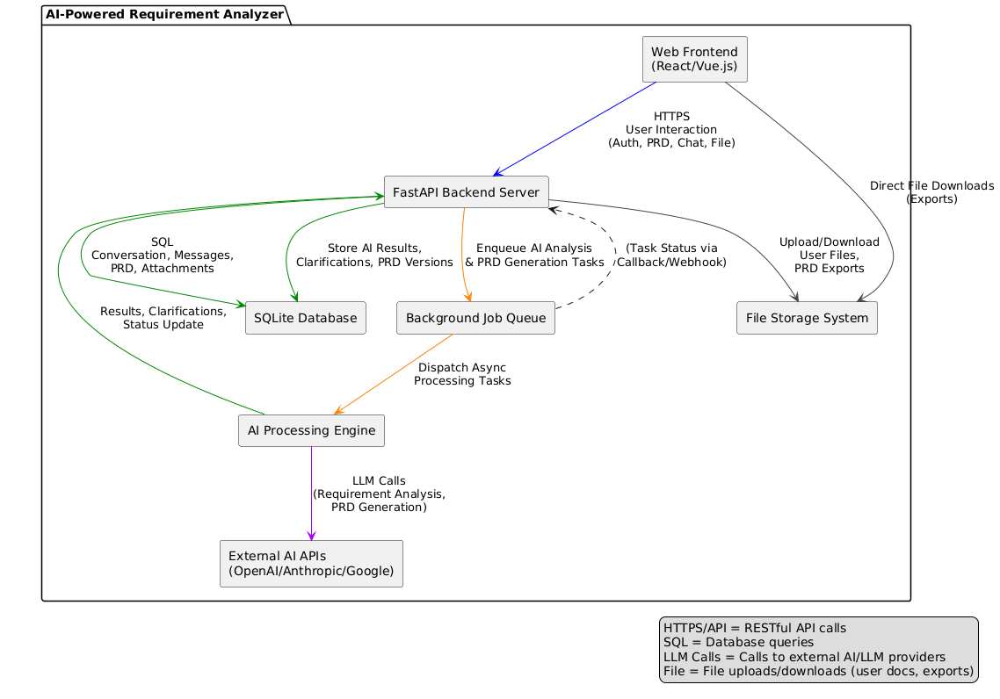
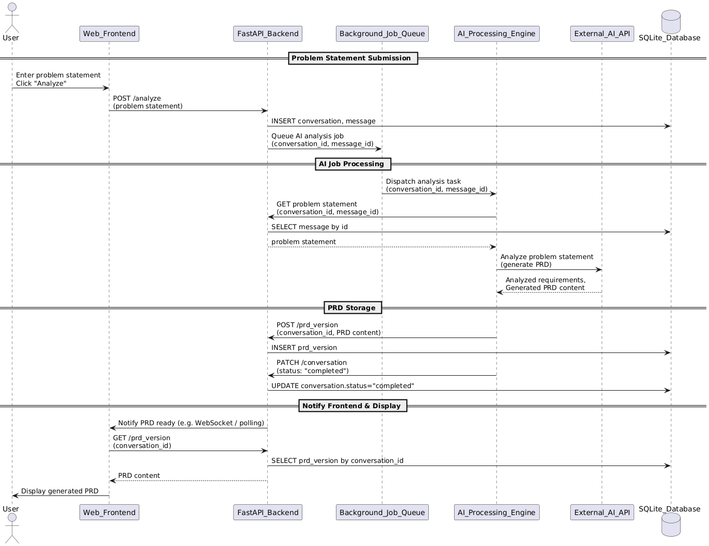

# AI-Powered Requirement Analyzer: Architecture Analysis

## Document Information

**Document Type:** Architecture Analysis  
**System:** AI-Powered Requirement Analyzer  
**Version:** 1.0  
**Date:** November 6, 2025  
**Prepared By:** Senior Software Architect

---

## Table of Contents

1. [Executive Summary](#executive-summary)
2. [Component Architecture Analysis](#component-architecture-analysis)
3. [Sequence Flow Analysis](#sequence-flow-analysis)
4. [Architecture Assessment](#architecture-assessment)
5. [Recommendations](#recommendations)

---

## Executive Summary

The AI-Powered Requirement Analyzer is a sophisticated web-based system designed to automatically analyze user-provided problem statements and generate comprehensive Product Requirements Documents (PRDs). The architecture employs a modern microservices-inspired approach with asynchronous processing, external AI integration, and persistent storage capabilities.

The system architecture demonstrates separation of concerns through distinct layers: presentation (Web Frontend), business logic (FastAPI Backend), asynchronous processing (Background Job Queue and AI Processing Engine), external integration (External AI APIs), and data persistence (SQLite Database and File Storage System).

---

## Component Architecture Analysis

### System Components

#### 1. Web Frontend (React/Vue.js)

**Purpose:** User interface layer providing human-computer interaction capabilities.

**Responsibilities:**
- User authentication and session management
- Problem statement input and submission
- PRD viewing and interaction
- Chat interface for clarifying questions
- File upload and download operations
- Real-time status updates and notifications

**Technology Stack:** React or Vue.js framework for reactive single-page application design.

**Communication Patterns:**
- HTTPS REST API calls to FastAPI Backend for all user interactions
- Direct file downloads from File Storage System for exported documents
- Bi-directional communication for real-time updates (WebSocket or polling)

**Architectural Role:** Thin client with presentation logic only; business logic resides in backend layers.

#### 2. FastAPI Backend Server

**Purpose:** Central orchestration layer and primary business logic container.

**Responsibilities:**
- API endpoint management and routing
- Request validation and response formatting
- Authentication and authorization enforcement
- Conversation and message persistence
- Job queue management and task submission
- PRD version management
- File metadata management
- Status aggregation and reporting

**Technology Stack:** FastAPI framework providing high-performance asynchronous Python API with automatic OpenAPI documentation.

**Communication Patterns:**
- Receives HTTPS requests from Web Frontend
- Executes SQL queries against SQLite Database for CRUD operations
- Enqueues processing tasks to Background Job Queue
- Manages File Storage System for uploads and downloads
- Receives results from AI Processing Engine via callbacks/webhooks

**Architectural Role:** Application controller and primary integration point for all system components.

#### 3. Background Job Queue

**Purpose:** Asynchronous task management and workload distribution.

**Responsibilities:**
- Task queuing and prioritization
- Worker process management
- Retry logic for failed tasks
- Task status tracking
- Load balancing across processing resources

**Technology Stack:** Likely Celery, RQ (Redis Queue), or similar Python-based distributed task queue.

**Communication Patterns:**
- Receives task submissions from FastAPI Backend
- Dispatches tasks to AI Processing Engine workers
- Provides status updates via callbacks to FastAPI Backend

**Architectural Role:** Decouples synchronous request handling from long-running AI processing operations, enabling scalability and responsiveness.

#### 4. AI Processing Engine

**Purpose:** Core AI/ML processing orchestration and business logic execution.

**Responsibilities:**
- Problem statement analysis and interpretation
- Requirement extraction and categorization
- PRD structure generation
- Clarifying question formulation
- Integration with external AI/LLM services
- Result validation and formatting
- Multi-step workflow coordination

**Technology Stack:** Python-based processing engine with AI/ML libraries and LLM integration frameworks.

**Communication Patterns:**
- Receives dispatched tasks from Background Job Queue
- Retrieves context data via API calls to FastAPI Backend
- Makes LLM API calls to External AI APIs
- Posts results back to FastAPI Backend for persistence

**Architectural Role:** Domain logic layer containing the core intelligence of requirement analysis and PRD generation.

#### 5. External AI APIs (OpenAI/Anthropic/Google)

**Purpose:** Large Language Model (LLM) capabilities for natural language processing and generation.

**Responsibilities:**
- Natural language understanding
- Requirement analysis and extraction
- PRD content generation
- Clarifying question generation
- Context-aware text processing

**Technology Stack:** Cloud-based LLM APIs from vendors including OpenAI (GPT-4), Anthropic (Claude), Google (Gemini/PaLM).

**Communication Patterns:**
- Receives API requests from AI Processing Engine
- Returns structured or unstructured analysis results

**Architectural Role:** External dependency providing AI capabilities; requires vendor management, API key security, and fallback strategies.

#### 6. SQLite Database

**Purpose:** Persistent relational data storage.

**Responsibilities:**
- Conversation history storage
- Message persistence
- PRD version tracking
- File attachment metadata
- Clarifying question storage
- Change tracking and audit trail
- Export history

**Technology Stack:** SQLite embedded relational database with SQLAlchemy ORM.

**Database Schema Components:**
- `conversation` - Top-level conversation sessions
- `message` - User and AI messages
- `file_attachment` - Uploaded file metadata and content
- `clarifying_question` - AI-generated questions and user responses
- `prd_version` - PRD document versions
- `prd_change` - Change tracking between versions
- `export` - Export operation history

**Communication Patterns:**
- Receives SQL queries from FastAPI Backend
- Optional metadata queries from File Storage System

**Architectural Role:** System of record for all structured data; provides transactional consistency and query capabilities.

#### 7. File Storage System

**Purpose:** Unstructured file management and storage.

**Responsibilities:**
- User-uploaded document storage
- PRD export file storage (PDF, Word, JSON, Markdown)
- File version management
- Storage optimization and cleanup
- Direct download support

**Technology Stack:** Local filesystem, object storage (S3-compatible), or cloud storage service.

**Communication Patterns:**
- Receives upload/download requests from FastAPI Backend
- Serves direct downloads to Web Frontend
- Optional metadata synchronization with SQLite Database

**Architectural Role:** Separation of concerns between structured data (database) and unstructured files (storage system).

### Architecture Patterns Identified

1. **Layered Architecture:** Clear separation between presentation, business logic, processing, and data layers.

2. **Asynchronous Processing:** Background job queue enables non-blocking operations for long-running AI tasks.

3. **Repository Pattern:** FastAPI Backend abstracts database operations from business logic.

4. **API Gateway Pattern:** FastAPI Backend serves as single entry point for all client requests.

5. **Worker Pattern:** AI Processing Engine workers consume tasks from queue for parallel processing.

6. **External Service Integration:** Abstraction layer for multiple AI vendor APIs with potential for failover.

### Scalability Considerations

**Current Architecture Strengths:**
- Asynchronous processing allows handling multiple concurrent users
- Background job queue enables horizontal scaling of AI workers
- Stateless API design supports multiple backend instances
- Database and file storage can be separated onto dedicated infrastructure

**Scalability Limitations:**
- SQLite database not suitable for high-concurrency write operations
- Single file storage system may become bottleneck
- External AI API rate limits and costs
- No explicit caching layer shown

---

## Sequence Flow Analysis

### Process Flow: PRD Generation

The sequence diagram illustrates the complete lifecycle of a PRD generation request from user submission through final delivery. The process is divided into four distinct phases:

#### Phase 1: Problem Statement Submission

**Actors Involved:** User, Web Frontend, FastAPI Backend, Background Job Queue, SQLite Database

**Flow:**

1. **User Action:** User enters problem statement into Web Frontend interface and initiates analysis by clicking "Analyze" button.

2. **Frontend Processing:** Web Frontend constructs HTTP POST request to `/analyze` endpoint containing problem statement payload.

3. **Backend Ingestion:** FastAPI Backend receives request and performs:
   - Request validation
   - Conversation initialization
   - Message creation with user input

4. **Database Persistence:** FastAPI Backend executes INSERT operations:
   - Creates new `conversation` record with initial status
   - Creates new `message` record containing problem statement
   - Commits transaction and retrieves generated IDs

5. **Job Queuing:** FastAPI Backend enqueues asynchronous processing task:
   - Submits job to Background Job Queue
   - Passes `conversation_id` and `message_id` as task parameters
   - Returns immediate response to frontend (non-blocking)

**Key Architectural Decision:** Immediate response to user with job queuing prevents timeout issues and provides responsive user experience for long-running AI operations.

**Data Flow:** User Input → Web Frontend → FastAPI Backend → SQLite Database (persistence) + Background Job Queue (async processing)

#### Phase 2: AI Job Processing

**Actors Involved:** Background Job Queue, AI Processing Engine, FastAPI Backend, SQLite Database, External AI API

**Flow:**

1. **Task Dispatch:** Background Job Queue dequeues task and dispatches to available AI Processing Engine worker.

2. **Context Retrieval:** AI Processing Engine requests problem statement:
   - Makes GET request to FastAPI Backend with `conversation_id` and `message_id`
   - FastAPI Backend queries SQLite Database: `SELECT message WHERE id = message_id`
   - Returns problem statement text to AI Processing Engine

3. **AI Analysis:** AI Processing Engine sends problem statement to External AI API:
   - Constructs prompt with PRD generation instructions
   - Includes problem statement as context
   - Requests structured PRD output

4. **AI Response:** External AI API returns:
   - Analyzed requirements (functional, non-functional, user stories)
   - Generated PRD content in structured format
   - Potential clarifying questions (if applicable)

**Key Architectural Decision:** Separation of AI processing into dedicated engine allows for specialized error handling, retry logic, and potential for multiple concurrent AI operations.

**Data Flow:** Background Job Queue → AI Processing Engine → FastAPI Backend (data retrieval) → SQLite Database → AI Processing Engine → External AI API → AI Processing Engine (with results)

**Critical Design Pattern:** Request-reply pattern with external service integration; AI Processing Engine maintains correlation between request and response.

#### Phase 3: PRD Storage

**Actors Involved:** AI Processing Engine, FastAPI Backend, SQLite Database

**Flow:**

1. **PRD Persistence:** AI Processing Engine posts generated PRD to FastAPI Backend:
   - POST request to `/prd_version` endpoint
   - Payload includes `conversation_id` and complete PRD content
   - FastAPI Backend executes INSERT operation: Creates new `prd_version` record
   - Links to parent conversation via foreign key

2. **Status Update:** AI Processing Engine updates conversation status:
   - PATCH request to `/conversation` endpoint
   - Updates status field to "completed"
   - FastAPI Backend executes UPDATE operation: `UPDATE conversation SET status = 'completed' WHERE id = conversation_id`
   - Marks conversation as ready for user viewing

**Key Architectural Decision:** Separate API calls for PRD creation and status update allow for potential intermediate states (e.g., "processing", "review_required") and provide clear audit trail.

**Data Flow:** AI Processing Engine → FastAPI Backend → SQLite Database (PRD storage + status update)

**Transactional Consideration:** Each operation is a separate transaction; potential for inconsistent state if status update fails after PRD creation (recommends compensating transaction pattern or atomic operation).

#### Phase 4: Notify Frontend & Display

**Actors Involved:** FastAPI Backend, Web Frontend, SQLite Database, User

**Flow:**

1. **Notification:** FastAPI Backend notifies Web Frontend of PRD completion:
   - WebSocket push notification (preferred for real-time updates)
   - OR polling mechanism where frontend periodically checks status
   - Notification includes `conversation_id` for retrieval

2. **PRD Retrieval:** Web Frontend requests generated PRD:
   - GET request to `/prd_version` endpoint with `conversation_id`
   - FastAPI Backend queries database: `SELECT prd_version WHERE conversation_id = conversation_id ORDER BY version_number DESC LIMIT 1`
   - Returns latest PRD content in response payload

3. **Display:** Web Frontend renders PRD content:
   - Parses structured PRD data
   - Renders in user-friendly format (markdown, rich text, or custom UI)
   - Enables user interactions (editing, commenting, exporting)

4. **User Interaction:** User views generated PRD and can:
   - Review requirements
   - Request modifications
   - Export to various formats
   - Continue conversation with clarifying questions

**Key Architectural Decision:** Notification mechanism selection (WebSocket vs. polling) impacts real-time responsiveness and server resource usage. WebSocket preferred for true real-time updates but requires connection management.

**Data Flow:** FastAPI Backend → Web Frontend (notification) → FastAPI Backend (retrieval request) → SQLite Database → FastAPI Backend → Web Frontend → User (display)

### Interaction Analysis

#### Synchronous vs. Asynchronous Operations

**Synchronous:**
- User → Web Frontend (immediate UI feedback)
- Web Frontend → FastAPI Backend → SQLite Database (standard CRUD operations)
- Web Frontend ↔ User (display and interaction)

**Asynchronous:**
- FastAPI Backend → Background Job Queue → AI Processing Engine (decoupled processing)
- AI Processing Engine → External AI API (potentially long-running)
- FastAPI Backend → Web Frontend (notification when complete)

**Rationale:** Long-running AI analysis operations (potentially 10-60+ seconds) require asynchronous handling to prevent:
- HTTP timeout failures
- Poor user experience with blocked interface
- Resource waste with open connections
- Scalability limitations

#### Error Handling Considerations

**Not Explicitly Shown But Required:**

1. **External AI API Failures:**
   - Timeout handling (AI APIs may take extended time)
   - Rate limiting (API quotas and throttling)
   - Error response handling (invalid input, service unavailable)
   - Retry logic with exponential backoff
   - Fallback to alternative AI providers

2. **Database Failures:**
   - Connection errors
   - Constraint violations
   - Transaction rollback on error
   - Data consistency checks

3. **Job Queue Failures:**
   - Task timeout handling
   - Dead letter queue for failed tasks
   - Job status tracking and monitoring
   - Manual retry capabilities

4. **Frontend Notification Failures:**
   - WebSocket disconnection handling
   - Polling fallback mechanism
   - Status endpoint for manual refresh

**Recommended Enhancement:** Add explicit error paths in sequence diagram showing failure scenarios and recovery mechanisms.

#### Performance Characteristics

**Latency Breakdown:**

1. **User Submission → Backend Acknowledgment:** < 100ms (network + validation + DB insert)
2. **Backend → Job Queue:** < 50ms (in-memory queue operation)
3. **Job Queue → AI Engine Dispatch:** < 1s (depends on worker availability)
4. **AI Engine → External AI API:** 5-60s (variable based on input complexity and AI provider)
5. **PRD Storage:** < 100ms (DB insert operation)
6. **Notification → User Display:** < 500ms (notification + retrieval + render)

**Total End-to-End Time:** 6-62 seconds (dominated by AI processing)

**Optimization Opportunities:**
- Pre-warm AI API connections
- Implement request batching for multiple analyses
- Cache common requirement patterns
- Optimize database queries with indexing
- Consider streaming responses for progressive display

#### Concurrency Considerations

**Multiple Concurrent Users:**

The architecture supports concurrent operations through:

1. **Stateless API Layer:** FastAPI Backend can handle multiple simultaneous requests without interference.

2. **Job Queue Buffering:** Multiple user submissions queue independently; workers process in parallel.

3. **Worker Pool Scaling:** AI Processing Engine can scale horizontally with additional worker processes.

4. **Database Isolation:** Transaction isolation prevents data corruption from concurrent writes.

**Bottlenecks:**
- SQLite write concurrency limitations (recommend PostgreSQL/MySQL for production)
- External AI API rate limits (requires quota management)
- Single file storage system (recommend object storage with CDN)

#### Data Consistency

**Consistency Guarantees:**

1. **Strong Consistency:** Within SQLite Database transactions (ACID properties).

2. **Eventual Consistency:** Between job queue state and database state (job may fail after DB insert).

3. **No Consistency:** Between external AI API state and internal state (API call may succeed but result storage may fail).

**Recommended Improvements:**
- Implement idempotency keys for API operations
- Add compensating transactions for partial failures
- Implement saga pattern for distributed transactions
- Add retry mechanisms with state tracking

---

## Architecture Assessment

### Strengths

#### 1. Clear Separation of Concerns
Each component has well-defined responsibilities without overlap, enabling independent development and testing.

#### 2. Asynchronous Processing Architecture
Background job queue prevents blocking operations and enables responsive user experience for long-running AI tasks.

#### 3. External Service Abstraction
AI Processing Engine abstracts external AI API integration, allowing for:
- Multiple AI provider support
- Vendor switching without frontend changes
- Centralized error handling and retry logic

#### 4. Scalability Foundation
Architecture supports horizontal scaling of:
- FastAPI Backend (multiple instances behind load balancer)
- AI Processing Engine workers (increase concurrency)
- Background Job Queue (distributed queue systems)

#### 5. Technology Selection
- FastAPI: Modern, high-performance Python framework with async support
- SQLAlchemy ORM: Provides database abstraction and migration support
- React/Vue.js: Modern frontend frameworks with reactive data binding
- Industry-standard AI APIs: Leverages cutting-edge LLM capabilities

#### 6. Persistence Layer
Comprehensive database schema with:
- Conversation history tracking
- Version control for PRDs
- Change tracking and audit trail
- Support for clarifying questions workflow

### Weaknesses

#### 1. SQLite Scalability Limitations
**Issue:** SQLite is not designed for high-concurrency write operations or distributed deployments.

**Impact:**
- Write bottleneck with multiple concurrent users
- No built-in replication or high availability
- Single point of failure
- File locking issues under load

**Recommendation:** Migrate to PostgreSQL or MySQL for production deployments.

#### 2. Single File Storage System
**Issue:** Centralized file storage without explicit architecture for distribution or redundancy.

**Impact:**
- Storage capacity limitations
- No built-in redundancy or disaster recovery
- Potential I/O bottleneck
- Difficult to scale horizontally

**Recommendation:** Implement object storage (AWS S3, MinIO, Google Cloud Storage) with CDN for downloads.

#### 3. External AI API Dependency
**Issue:** Complete dependency on external AI services without explicit fallback or caching strategies shown.

**Impact:**
- Service availability risk (vendor downtime affects system)
- Cost implications (per-request pricing)
- Rate limiting constraints
- Vendor lock-in concerns
- Data privacy considerations (sending data to third parties)

**Recommendation:**
- Implement circuit breaker pattern
- Add fallback to alternative AI providers
- Consider self-hosted LLM options for sensitive data
- Implement caching for repeated similar requests

#### 4. Lack of Caching Layer
**Issue:** No explicit caching mechanism shown in architecture.

**Impact:**
- Repeated database queries for frequently accessed data
- No caching of external AI responses
- Higher latency for common operations
- Increased database load

**Recommendation:** Implement Redis or similar caching layer for:
- Frequently accessed PRDs
- User session data
- Common AI analysis results
- API response caching

#### 5. Notification Mechanism Ambiguity
**Issue:** Sequence diagram shows "WebSocket / polling" without clear implementation guidance.

**Impact:**
- Inconsistent user experience
- Potential resource waste with polling
- WebSocket connection management complexity

**Recommendation:** Standardize on WebSocket for real-time updates with polling fallback for incompatible clients.

#### 6. Limited Error Handling Visibility
**Issue:** Diagrams don't show error paths, retry logic, or failure recovery mechanisms.

**Impact:**
- Unclear system behavior during failures
- Potential data inconsistency
- Poor user experience with generic error messages

**Recommendation:** Document comprehensive error handling strategy including:
- Retry policies for each integration point
- Circuit breaker implementations
- Graceful degradation strategies
- User-friendly error messaging

#### 7. Security Considerations Not Shown
**Issue:** Authentication, authorization, and data security mechanisms not explicitly illustrated.

**Impact:**
- Unclear security model
- Potential vulnerabilities in implementation
- Compliance risks for sensitive data

**Recommendation:** Add security architecture diagram showing:
- Authentication flow (OAuth 2.0, JWT)
- Authorization model (RBAC, ABAC)
- API key management for external services
- Data encryption at rest and in transit
- Audit logging mechanisms

#### 8. Monitoring and Observability
**Issue:** No mention of logging, metrics, or monitoring infrastructure.

**Impact:**
- Difficult to troubleshoot production issues
- No visibility into system health
- Inability to detect performance degradation
- Challenging capacity planning

**Recommendation:** Implement comprehensive observability stack:
- Structured logging (ELK stack, CloudWatch)
- Metrics collection (Prometheus, Grafana)
- Distributed tracing (Jaeger, OpenTelemetry)
- Application Performance Monitoring (APM)

### Risk Analysis

#### High-Risk Areas

1. **External AI API Dependency**
   - **Risk Level:** HIGH
   - **Mitigation:** Multi-provider strategy, circuit breakers, fallback responses

2. **SQLite Production Use**
   - **Risk Level:** HIGH
   - **Mitigation:** Database migration plan to production-grade RDBMS

3. **Data Loss on Storage Failure**
   - **Risk Level:** MEDIUM
   - **Mitigation:** Implement backup strategy, redundant storage

4. **Security Vulnerabilities**
   - **Risk Level:** MEDIUM
   - **Mitigation:** Security audit, penetration testing, compliance review

#### Operational Risks

1. **Cost Escalation:** External AI API usage costs can scale unpredictably with user growth.
2. **Vendor Lock-in:** Tight coupling to specific AI providers limits flexibility.
3. **Data Privacy:** Sending user data to external APIs may violate privacy regulations.
4. **Performance Degradation:** Lack of caching and optimization may cause slowdowns under load.

---

## Recommendations

### Immediate Improvements (0-3 Months)

#### 1. Database Migration Strategy
**Priority:** CRITICAL

**Action Items:**
- Develop migration plan from SQLite to PostgreSQL
- Create database migration scripts using Alembic
- Implement database connection pooling
- Add database replication for high availability
- Establish backup and recovery procedures

**Expected Outcome:** Production-ready database infrastructure supporting concurrent users and providing data durability.

#### 2. Implement Caching Layer
**Priority:** HIGH

**Action Items:**
- Deploy Redis cluster for caching
- Implement cache-aside pattern for frequently accessed data
- Cache AI API responses for similar queries
- Add cache invalidation strategy
- Monitor cache hit ratios

**Expected Outcome:** Reduced latency (30-50% improvement), lower database load, decreased AI API costs.

#### 3. Error Handling and Retry Logic
**Priority:** HIGH

**Action Items:**
- Implement exponential backoff for external API calls
- Add circuit breaker pattern for AI API integration
- Create dead letter queue for failed jobs
- Implement comprehensive error logging
- Add user-friendly error messages

**Expected Outcome:** Improved system reliability and user experience during failures.

#### 4. Security Hardening
**Priority:** HIGH

**Action Items:**
- Implement JWT-based authentication
- Add role-based access control (RBAC)
- Encrypt sensitive data at rest
- Secure API key storage (secrets management)
- Add rate limiting to prevent abuse
- Implement CORS policies
- Conduct security audit

**Expected Outcome:** Secure production system meeting industry security standards.

### Medium-Term Enhancements (3-6 Months)

#### 5. Multi-Provider AI Strategy
**Priority:** MEDIUM

**Action Items:**
- Abstract AI provider interface
- Implement provider selection logic (cost, performance, availability)
- Add automatic failover between providers
- Implement request routing based on requirements
- Consider self-hosted LLM for sensitive operations

**Expected Outcome:** Reduced vendor lock-in, improved availability, cost optimization.

#### 6. Observability Stack
**Priority:** MEDIUM

**Action Items:**
- Deploy centralized logging (ELK or CloudWatch)
- Implement metrics collection (Prometheus)
- Create monitoring dashboards (Grafana)
- Add distributed tracing (Jaeger)
- Implement health check endpoints
- Create alerting rules for critical issues

**Expected Outcome:** Proactive issue detection, faster troubleshooting, data-driven optimization.

#### 7. Object Storage Migration
**Priority:** MEDIUM

**Action Items:**
- Migrate file storage to S3-compatible object storage
- Implement pre-signed URLs for secure file access
- Add CDN for file downloads (CloudFront, CloudFlare)
- Implement storage lifecycle policies
- Add file encryption

**Expected Outcome:** Scalable file storage, improved download performance, better disaster recovery.

#### 8. WebSocket Implementation
**Priority:** MEDIUM

**Action Items:**
- Implement WebSocket server for real-time notifications
- Add connection management and heartbeat
- Implement fallback to polling for incompatible clients
- Add message queuing for offline clients
- Monitor connection metrics

**Expected Outcome:** Real-time user experience, reduced server load from polling.

### Long-Term Strategic Initiatives (6-12 Months)

#### 9. Microservices Decomposition
**Priority:** LOW (for current scale)

**Consideration:** As system grows, consider decomposing monolithic FastAPI backend into:
- User Management Service
- Conversation Service
- PRD Generation Service
- File Management Service
- Notification Service

**Benefits:**
- Independent scaling of components
- Technology diversity
- Fault isolation
- Team autonomy

**Trade-offs:**
- Increased operational complexity
- Distributed system challenges
- Higher infrastructure costs

#### 10. Machine Learning Optimization
**Priority:** LOW

**Action Items:**
- Analyze AI API usage patterns
- Fine-tune models for specific PRD generation use cases
- Implement model serving infrastructure
- Experiment with smaller, faster models for simple requests
- Consider embedding models for semantic search

**Expected Outcome:** Reduced AI costs, improved latency, customized model performance.

#### 11. Advanced Features
**Priority:** LOW

**Potential Features:**
- Real-time collaborative editing
- PRD template marketplace
- Automated requirement validation
- Integration with project management tools (Jira, Linear)
- Version control integration (GitHub, GitLab)
- Automated testing scenario generation
- Stakeholder review workflows

#### 12. Global Distribution
**Priority:** LOW (for current scale)

**Consideration:** For international expansion:
- Deploy to multiple geographic regions
- Implement geo-routing
- Replicate databases across regions
- Consider data residency requirements
- Optimize for edge computing

### Performance Optimization Roadmap

#### Phase 1: Measurement (Month 1)
- Establish performance baselines
- Implement load testing
- Identify bottlenecks
- Create performance SLOs

#### Phase 2: Quick Wins (Months 2-3)
- Database query optimization
- Add indexes
- Implement caching
- Optimize API payload sizes

#### Phase 3: Infrastructure (Months 4-6)
- Database migration
- Object storage implementation
- CDN deployment
- Horizontal scaling setup

#### Phase 4: Advanced Optimization (Months 7-12)
- Algorithm optimization
- Asynchronous processing improvements
- Machine learning optimization
- Edge computing exploration

### Success Metrics

#### Technical Metrics
- **API Response Time:** < 200ms (p95)
- **PRD Generation Time:** < 30s (p95)
- **System Availability:** > 99.9%
- **Database Query Time:** < 50ms (p95)
- **Cache Hit Rate:** > 80%
- **Error Rate:** < 0.1%

#### Business Metrics
- **User Satisfaction:** > 4.5/5
- **PRD Accuracy:** > 90% (user validation)
- **Time Savings:** > 80% vs. manual PRD creation
- **User Retention:** > 70% (30-day)
- **Cost per PRD:** < $X target

#### Operational Metrics
- **Mean Time to Recovery (MTTR):** < 30 minutes
- **Mean Time Between Failures (MTBF):** > 30 days
- **Deployment Frequency:** > 1 per week
- **Change Failure Rate:** < 5%

---

## Conclusion

The AI-Powered Requirement Analyzer demonstrates a well-architected foundation with clear separation of concerns, asynchronous processing capabilities, and integration with cutting-edge AI technologies. The component architecture provides a solid structure for building a scalable system, while the sequence diagram clearly illustrates the end-to-end user journey.

However, several areas require attention before production deployment:

1. **Database Infrastructure:** SQLite must be replaced with a production-grade database system.
2. **Caching Strategy:** Implement Redis or similar caching to improve performance and reduce costs.
3. **Error Handling:** Comprehensive error handling and retry mechanisms are essential.
4. **Security:** Authentication, authorization, and data protection must be implemented.
5. **Observability:** Monitoring and logging infrastructure is critical for operational excellence.

By addressing these recommendations in a phased approach, the system can evolve from a prototype architecture into a production-ready, scalable, and maintainable platform capable of serving thousands of concurrent users while maintaining high performance and reliability standards.

The modular architecture provides flexibility for future enhancements and technology evolution, positioning the system for long-term success in the competitive landscape of AI-powered software development tools.
